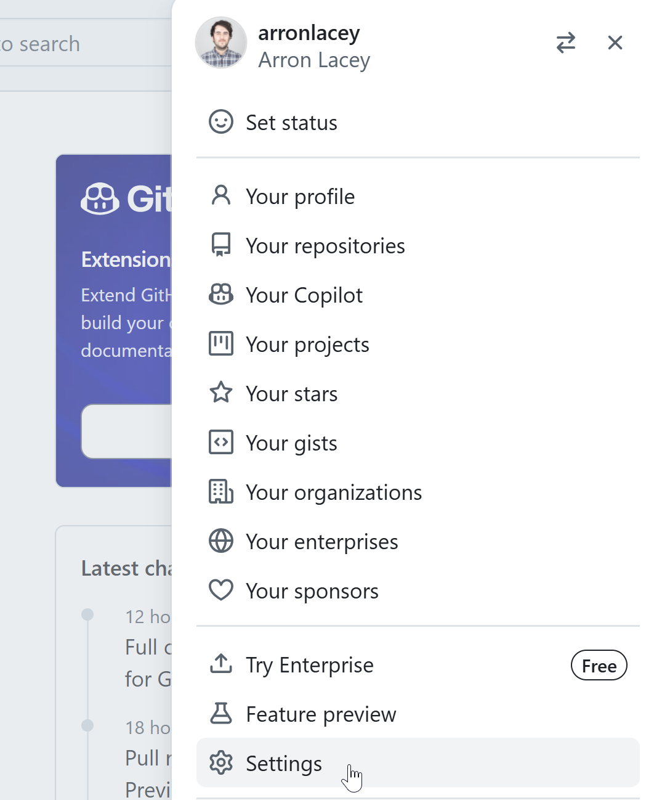
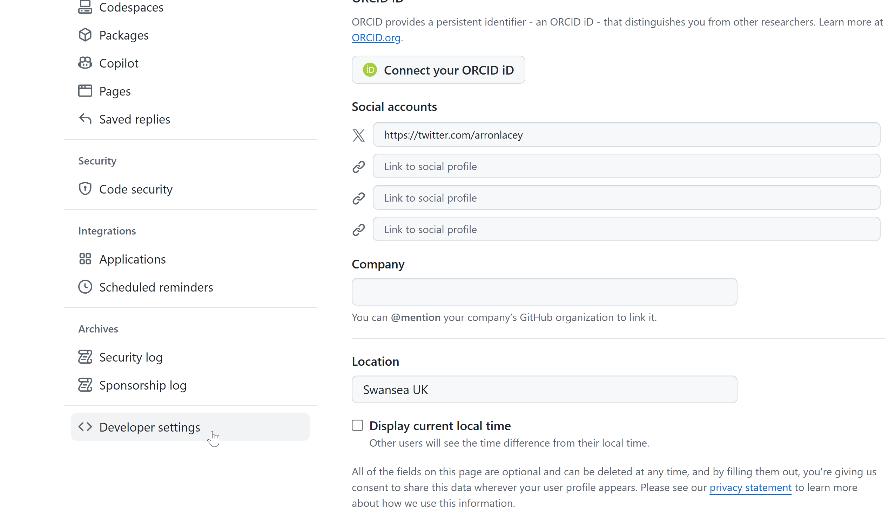
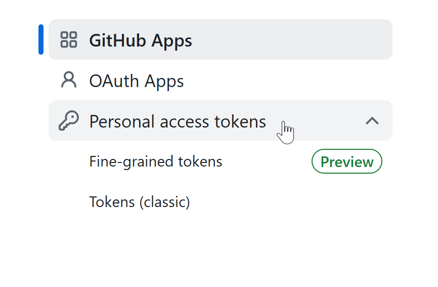
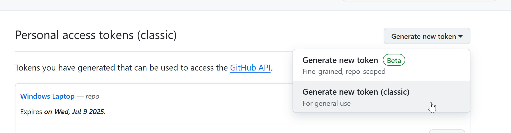
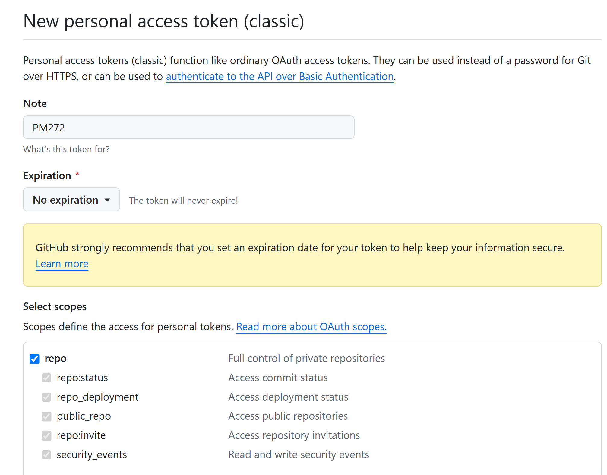
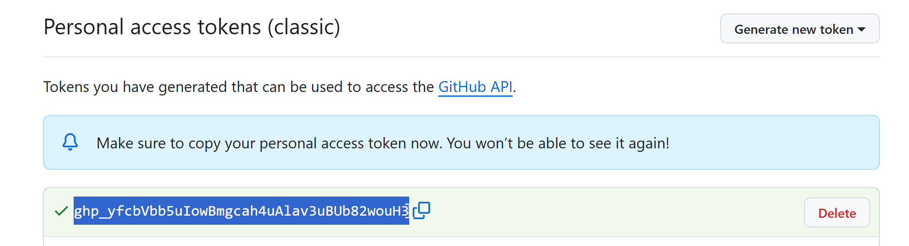
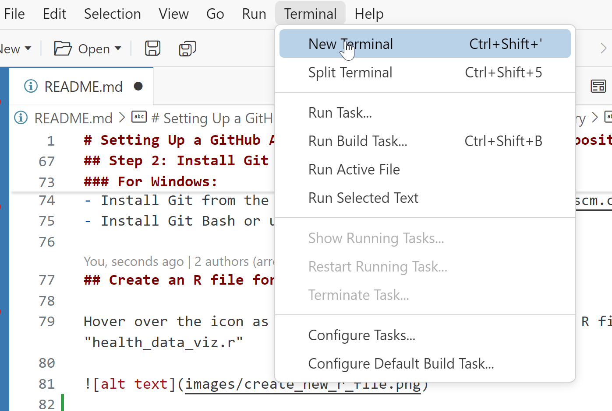

# Setting Up a GitHub Account and Creating a New Public Repository

## Step 1: Create a GitHub Account

### 1.1 Navigate to GitHub
- Go to [GitHub](https://github.com/) and follow the prompts to sign up for an account.

### 1.2 Fill Out the Registration Form
- Enter your email address, choose a username, and create a strong and unique password.
- For more information on creating a strong password, see [GitHub's guide on strong passwords].

### 1.3 Verify Your Email
- After signing up, verify your email address by clicking on the verification link sent to your email.

### 1.4 Create Personal Access Token

You will need to set up a Personal Access Token to connect to GitHub from your computer. Got to Settings > Developer Options > Create Personal Access Token > Classic Token. Please see steps below:



**Go to Developer Settings:**



**Choose Personal Access Token**




**Choose Classic**



**Fill in the Note (just a name) and set exipiration to no exipiry**



**Copy the Access Token**



**Copy this Personal Access Token somwhere safe**. No seriously, **Guard it with your life**. You will need to paste it everytime you want to retrieve or send files to GitHub from your local machine. Once you leave this page you will never be able to see it again. Email it to yourself or save it in a file somewhere on your laptop


## Step 2: Create a New Public Repository

### 2.1 Log In to GitHub
- Log in to your GitHub account.

### 2.2 Navigate to the Repositories Page
- In the upper-right corner of any page, select your profile picture or avatar, then click on **Repositories**.


### 2.3 Create a New Repository
- Click on the **New** button on the right-hand side of the screen.


### 2.4 Fill Out the Repository Details
- **Repository name**: Type a short, memorable name for your repository.
- **Description**: Optionally, add a description of your repository.
- **Visibility**: Choose **Public**.
- **Initialize this repository with a README**: Select this option to add a README file.
- **Add a .gitignore file**: Optionally, select a .gitignore template for your development framework.
- **Choose a license**: Select a license or choose **None** if you don't need one.
- Click **Create repository**.


## View new repository

Your repository will look like this (below). Click on the green Code button and copy the the repository URL (you will need it for later).


## Cloning the Repository

Open Positron, select the files icon (top left) on the blue bar and clone. Positron will ask you where to save the cloned repository - I reccomend saving it in your PM272/ directory, but anywhere will do! 


## Step 2: Install Git and Set Up Your Local Environment

### For Mac:
- Install Git if it's not already installed. You can download it from the [official Git website](https://git-scm.com/downloads).
- Install a terminal application like Terminal or iTerm.

### For Windows:
- Install Git from the [official Git website](https://git-scm.com/downloads).
- Install Git Bash or use the Command Prompt.

## Create an R file for the session

Hover over the icon as in the image below and create a new R file called "health_data_viz.r"


## Sending the files to GitHub

Follow these steps:

1. Open the terminal and choose GitBash once opened




2. In the terminal type these commands:

```
git add .
```

This adds all the changed files ready to commit to your local git database

```
git commit -m "added section on ggplot"
```

This is a small message so that you know what you did when looking at the databse history. It may also be things like "added the dplyr library" or "wrote for loop for kmeans" etc

At this stage you will likely be asked to put in your email address you used to register with GitHub and your Git Hub username.


Type the following into the terminal to add your email and username

```
git config --global user.email "a.s.lacey@swansea.ac.uk"
```

```
git config --global user.name "arronlacey"
```

Then finally you can push your code up to GitHub:

```
git push
```

You can now go to your repository on GitHub, refresh the page and see your work.