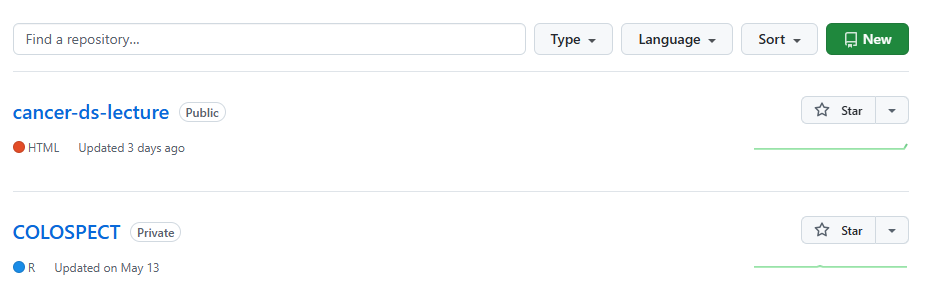
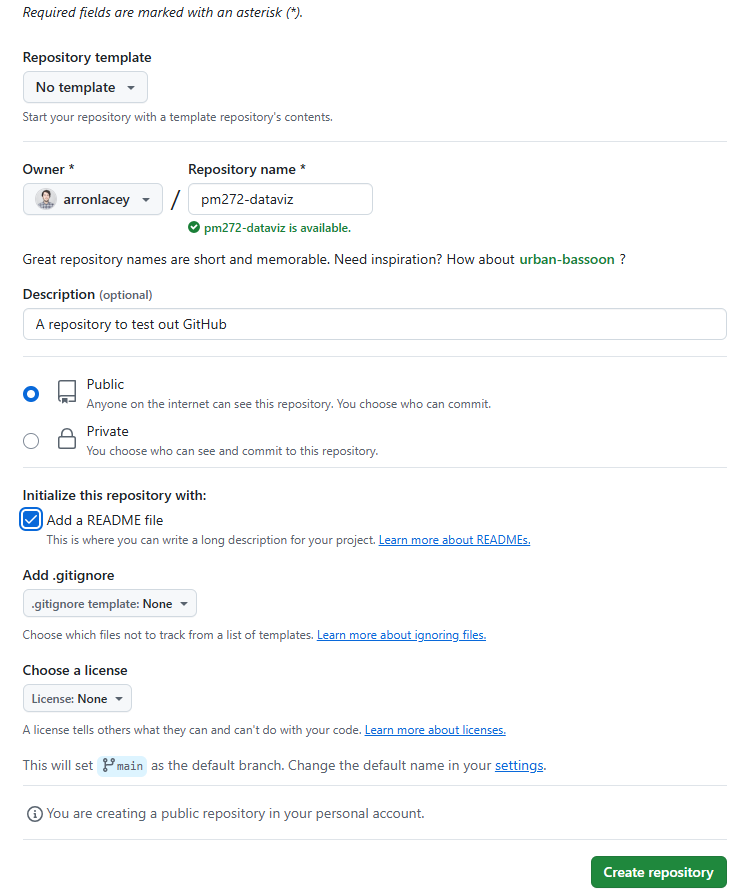
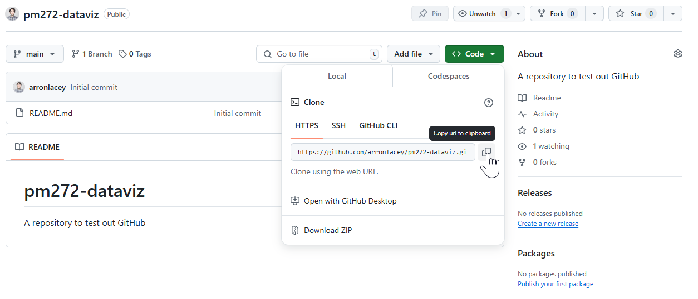
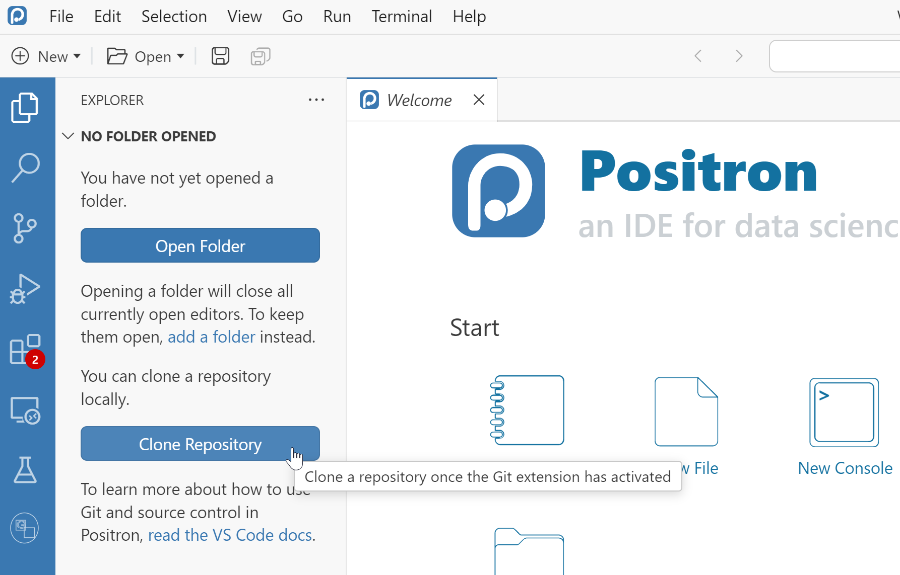
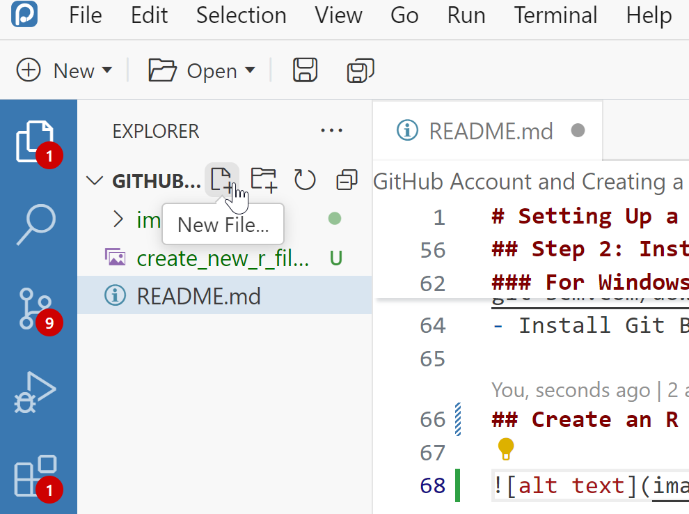

# Setting Up a GitHub Account and Creating a New Public Repository

## Step 1: Create a GitHub Account

### 1.1 Navigate to GitHub
- Go to [GitHub](https://github.com/) and follow the prompts to sign up for an account.

### 1.2 Fill Out the Registration Form
- Enter your email address, choose a username, and create a strong and unique password.
- For more information on creating a strong password, see [GitHub's guide on strong passwords].

### 1.3 Verify Your Email
- After signing up, verify your email address by clicking on the verification link sent to your email.

### 1.4 Optional: Set Up Two-Factor Authentication
- For added security, set up two-factor authentication. This can be done in your account settings.

## Step 2: Create a New Public Repository

### 2.1 Log In to GitHub
- Log in to your GitHub account.

### 2.2 Navigate to the Repositories Page
- In the upper-right corner of any page, select your profile picture or avatar, then click on **Repositories**.

### 2.3 Create a New Repository
- Click on the **New** button on the right-hand side of the screen.

### 2.4 Fill Out the Repository Details
- **Repository name**: Type a short, memorable name for your repository.
- **Description**: Optionally, add a description of your repository.
- **Visibility**: Choose **Public**.
- **Initialize this repository with a README**: Select this option to add a README file.
- **Add a .gitignore file**: Optionally, select a .gitignore template for your development framework.
- **Choose a license**: Select a license or choose **None** if you don't need one.
- Click **Create repository**.

## View new repository

Your repository will look like this (below). Click on the green Code button and copy the the repository URL (you will need it for later).

## Cloning the Repository

Open Positron, select the files icon (top left) on the blue bar and clone. Positron will ask you where to save the cloned repository - I reccomend saving it in your PM272/ directory, but anywhere will do! 

## Step 2: Install Git and Set Up Your Local Environment

### For Mac:
- Install Git if it's not already installed. You can download it from the [official Git website](https://git-scm.com/downloads).
- Install a terminal application like Terminal or iTerm.

### For Windows:
- Install Git from the [official Git website](https://git-scm.com/downloads).
- Install Git Bash or use the Command Prompt.

## Create an R file for the session

Hover over the icon as in the image below and create a new R file called "health_data_viz.r"

